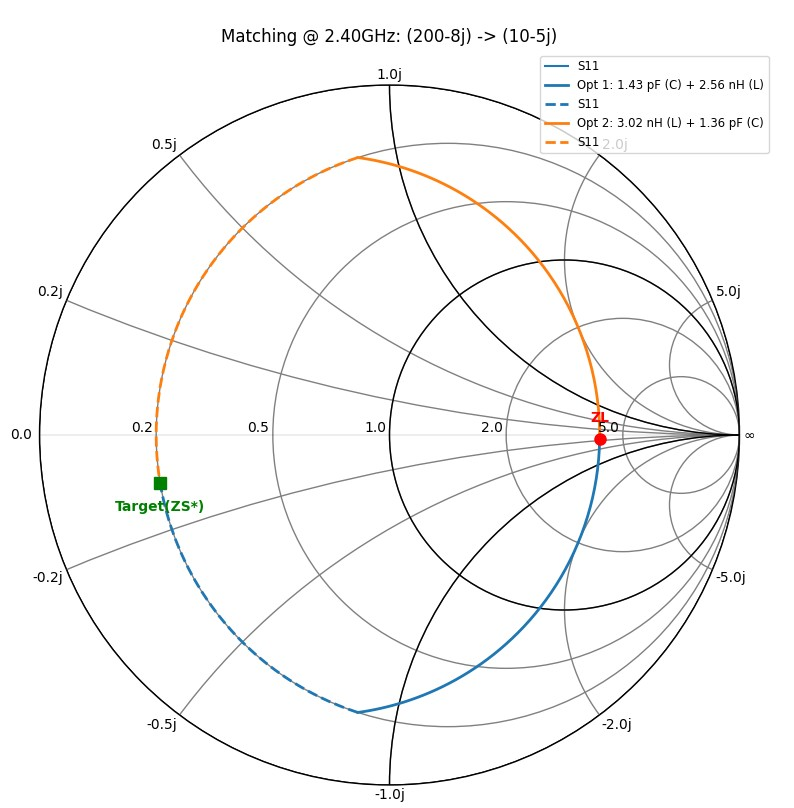

RF-Matching-Tool (自動化 RF 阻抗匹配計算與視覺化工具)<br>
這是一個基於 Python 開發的射頻阻抗匹配工具，旨在自動化計算 L-Match 匹配網路參數，並提供直觀的史密斯圖 (Smith Chart) 軌跡視覺化。本工具特別適用於高頻電路設計前期，快速評估元件數值與匹配路徑。<br>
核心功能 (Core Features)自動化匹配計算：支援複數源阻抗 ($Z_S$) 與負載阻抗 ($Z_L$) 的共軛匹配計算。<br>
拓樸自動切換：根據負載在史密斯圖上的位置，自動判斷並切換 L-Match 拓樸（如 Shunt-Series 或 Series-Shunt），以確保路徑避開匹配禁區。<br>
路徑視覺化：整合 matplotlib 與 scikit-rf，動態繪製阻抗移動軌跡（恆定電阻/電導圓弧線）。<br>
元件數值轉換：自動根據操作頻率（如 2.4 GHz 或 28 GHz）將電抗值轉換為實體 SMD 元件數值（nH/pF）。<br>
Python 3.14.4<br>
Numpy: 處理複數阻抗矩陣運算。<br>
Matplotlib: 負責繪製高品質的史密斯圖與軌跡曲線。<br>
scikit-rf (skrf): 提供標準的射頻工程計算與座標轉換。<br>
實作原理：本工具透過解析幾何方式模擬元件在史密斯圖上的移動：<br>
並聯電容/電感：阻抗沿著恆定電導圓 (Constant Admittance Circle) 移動。<br>
串聯電容/電感：阻抗沿著恆定電阻圓 (Constant Resistance Circle) 移動。<br>
程式會自動迭代尋找這兩條圓弧的交點，從而得出精確的元件數值。<br>
# 使用範例 (Usage Example)<br>
範例：將 10 + 5j Ohm 匹配至 200 - 8j Ohm (於 2.4 GHz)<br>
```solve_and_plot_matching(ZS=10+5j, ZL=200-8j, freq=2.4e9)```<br>

<br>

<br>

